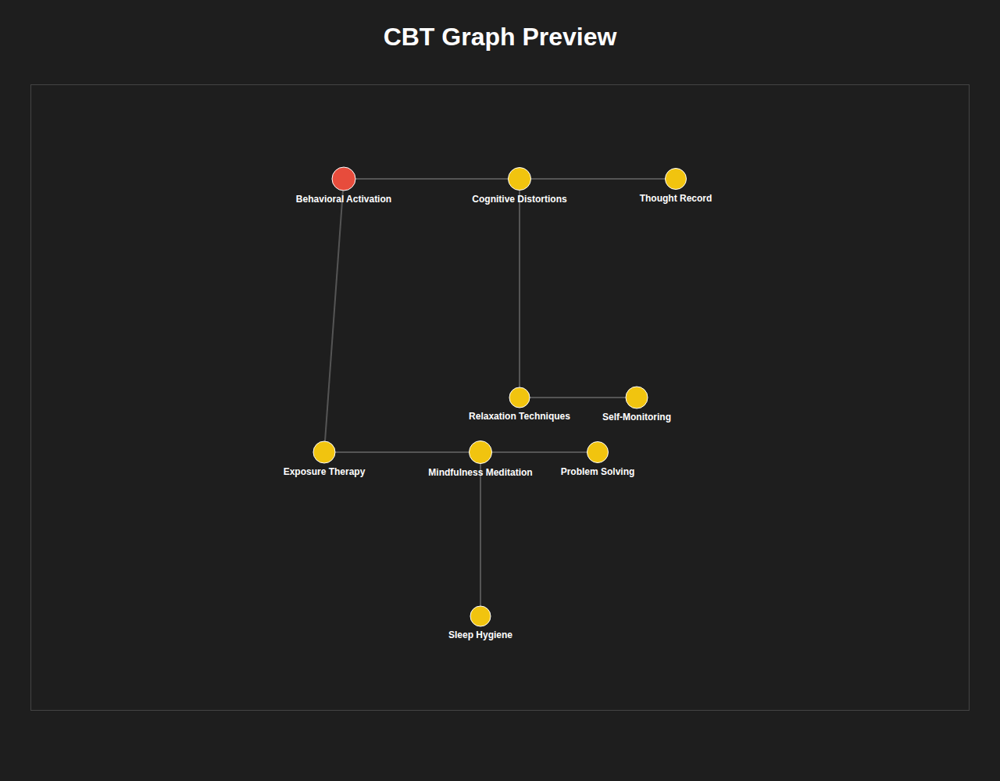

# Multiple Viewer (CBT Graph Viewer + Brain Modeling Sandbox)

Multiple Viewer is a C++17 console application for exploring graph data and experimenting with brain-model overlays. It combines interactive navigation, graph analytics, headless CLI workflows, and a deterministic model/simulation core used by domain plugins and BDD scenarios.

## Overview

Multiple Viewer is a robust system for graph visualization and brain-model simulation.



## Core Features

### 1. Interactive Graph Viewer
- **Multiple View Modes**:
    - **Perspective (BFS)**: Expansion from a central focus node with collision-free layout.
    - **Nexus Flow**: Organic force-directed layout with dynamic physics simulation.
    - **Book View**: Hierarchical subject-based grouping of nodes.
    - **Page View**: Detailed drill-down into individual node properties and neighbors.
- **Advanced Navigation**: Real-time pan and zoom, focus cycling, and multi-token search.
- **Visual Feedback**: Depth-based node sizing and weight-based color coding.

### 2. Brain Modeling Sandbox
- **Atlas Integration**: Load `.brn` atlas files and region labels.
- **Overlay System**: Map graph nodes to anatomical brain regions with Z-ordered rendering.

### 3. Headless CLI Workflows
- Load/Save graphs in CSV and JSON formats.
- **SVG Export**: Generate high-quality vector representations of graph layouts.
- MeSH Discovery: Automated hierarchical discovery from seed terms.
- Genome Query: Integrated API support for genomic data ingestion.

### 4. SDD-Aligned Architecture
- **Sorrel Driven Development (SDD)**: A testing architecture that enforces structural constraints before execution.
- **Verification Cards**: C++ based units that perform empirical observations (e.g., measuring latency, verifying filesystem state).
- **BDD Testing**: Comprehensive feature verification using a Gherkin-like DSL and a mock `UIPrinter` for visual assertions.

## Repository layout

- `apps/viewer/` — main application entrypoint (`viewer`).
- `src/` — core graph/viewer logic and extension modules.
  - `src/model/` — brain model entities, repository, deterministic kernel/event bus, and domain plugins.
  - `src/render/`, `src/input/`, `src/layout/`, `src/analytics/`, `src/io/`, `src/scripting/`, `src/ui/`.
- `tests/` — unit-style and BDD test harnesses + step definitions.
- `docs/` — guides, architecture notes, and analysis documents.

## Build instructions (current)

This repository is built via the top-level `Makefile`.

### Prerequisites

- `g++` with C++17 support
- `make`

### Build everything

```bash
make all
```

This generates:

- `build/viewer`
- `build/unit_tests`
- `build/bdd_tests`

### Clean artifacts

```bash
make clean
```

### Build and run tests in one command

```bash
make test
```

## Running the viewer

### Interactive mode

```bash
./build/viewer
```

### Interactive mode with initial graph/model inputs

```bash
./build/viewer \
  --load-graph graph_input.csv \
  --load-atlas atlas.brn \
  --load-labels labels.txt \
  --load-overlay overlay.txt
```

### Show CLI help

```bash
./build/viewer --help
```

## Headless CLI workflows

Load a graph and print details for one node:

```bash
./build/viewer --load-graph graph_input.csv --get-node-details 42
```

Load and re-save a graph:

```bash
./build/viewer --load-graph graph_input.csv --save-graph out.csv
```

Export a graph layout as SVG:

```bash
./build/viewer --load-graph graph_input.csv --export-svg output.svg
```

## Testing

After building (`make all`) you can run test binaries directly:

```bash
./build/unit_tests
./build/bdd_tests
```

Or run both through the Make target:

```bash
make test
```

## Notes

- A legacy `CMakeLists.txt` exists, but the actively maintained build flow in this repository is the `Makefile` targets above.
- The viewer is terminal-first; no GUI/web frontend is required for core usage.
